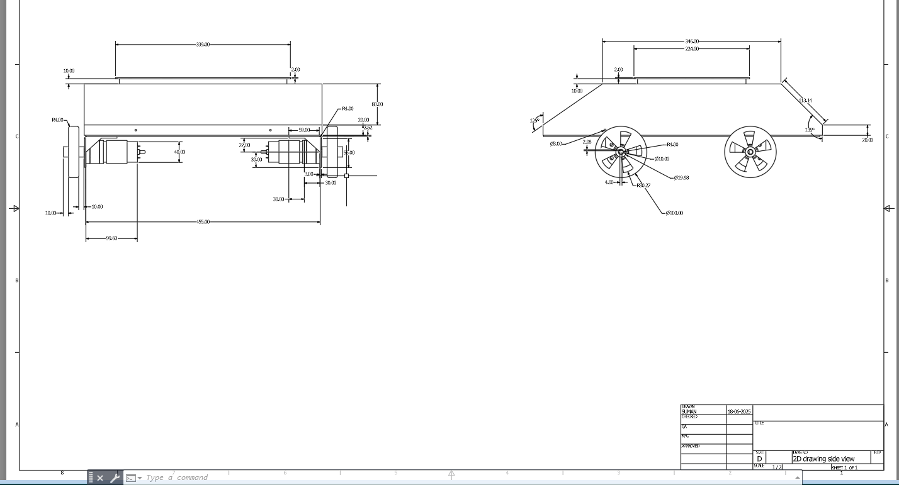

# Industrial-Mobile-Robot

This repository contains the development, control algorithms, Circuit Architecture and simulation setup for an Industrial Mobile Robot designed for both automotive and manual control operations.  
The robot is built using a Master-Slave Algorithm with I2C communication protocol for coordinated control between distributed microcontrollers.  
A fully parametric CAD model has been integrated into ROS and converted to URDF format, enabling teleoperation and visualization in simulation environments.

---

## 📘 Project Overview

The Industrial Mobile Robot operates under two control modes:  
1. Manual Control – teleoperation via ROS or joystick.  
2. Automotive Mode – semi-autonomous motion with sensor feedback.

The robot uses a distributed Master–Slave system, where:
- The Master Controller handles command logic, speed control, and I²C coordination.  
- The Slave Controllers manage the motors, sensors, and actuator feedback.  

This distributed structure improves response time, modularity, and system scalability.

---

## ⚙️ Key Features

- Master–Slave Algorithm: Multi-microcontroller coordination for motion and sensor tasks.  
- I²C Communication: Reliable serial data exchange between controllers.  
- Dual Mode Control: Switch between manual teleoperation and automotive (semi-autonomous) mode.  
- ROS–URDF Integration: The CAD model is converted to URDF for simulation in RViz and Gazebo.  
- Teleoperation Interface: Controlled through ROS nodes or Python scripts.  
- Sensor & Motor Fusion:Lidar, encoders, and motor drivers integrated for smooth operation.

---
## URDF
:- there is 2 urdf pkg one is one is just a urdf pkg, in 1st file the mobile robot is spawn in gazebo and rviz and second one is created as teleop based urdf with full workspace .
  1) urdf pkg:- iiest_amr_description
  2) teleop based urdf with full workspace created:- iiest_amr_ws

1) for iiest_amr_description

🧱 1️⃣ Create the workspace structure

mkdir -p ~/imr_ws/src
cd ~/imr_ws/src

download the files  iiest_amr_description, and put it in the created imr_ws workspace/src.

back to workspace:
---

Navigate into the extracted workspace folder using terminal:

cd imr_ws

🖥️ Then in Terminal 1 – Launch Gazebo with Robot

colcon build
source install/setup.bash
ros2 launch iiest_amr_description gazebo.launch.py

🖥️ Then in Terminal 2 – Launch Gazebo with Robot
colcon build
source install/setup.bash
ros2 launch iiest_amr_description display.launch.py

---

🧮 System Components

| Component         | Description                                       |
| ----------------- | ------------------------------------------------- |
| Master Controller | Arduino Uno (I²C Master) |
| Slave Controllers | Arduino Uno      |
| Communication     | I²C (SDA, SCL) protocol                           |
| Motor Drivers     | bts7960                                           |
| Sensors           |  Encoders, optional LIDAR                         |
| Power Supply      | 12V lead cell battery                             |
| Control Modes     | Manual (Teleop) / Automotive                      |
| Software          | ROS, Python, Arduino                              |
| Simulation        | URDF + Gazebo                                     |

---

📧 Contact

For questions or collaborations, please contact:
📩 Suman Das Adhikary — [sumandasadhikary457@gmail.com]

🪪 License

MIT License © 2025
Use and modify with attribution.
